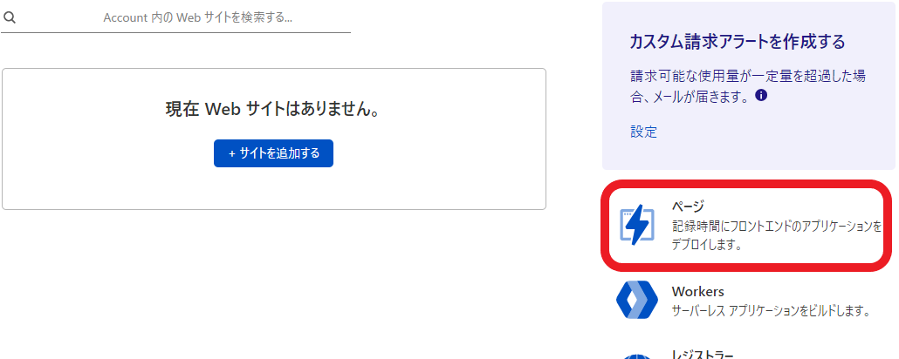
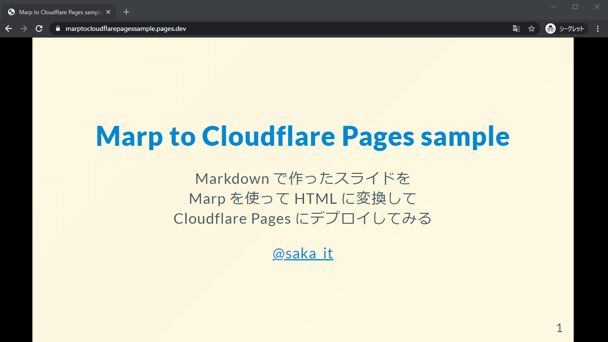

# **Marp to Cloudflare Pages sample**

Markdown で作ったスライドを 
Marp を使って HTML に変換して
Cloudflare Pages にデプロイしてみる

[@saka_it](https://twitter.com/saka_it)

---

# リソース
このスライドも含めた作成物は、
下記の Github リポジトリに格納しています

https://github.com/SakaITa/MarpToCloudflarePagesSample

---

# 前提

- npm コマンドが使用できること
  - Node.js をインストールしておいてください
- Github が使えること
- Cloudflare のアカウントがあること

---

# 手順

1. スライドを作る
2. package.json を作る
3. Github にプッシュする
4. Cloudflare Pages を設定する
   
---

# スライドを作る
- フォルダ構成を下記のようにしておきます

```
├ images/
│  └ <画像ファイルを入れる>
└ index.md
```
- 後は通常通りに作るだけです
- ちなみに、mdファイルを複数入れて、
  複数スライドを作成することも可能です

---

# package.json を作る(1)
- 下記コマンドを実行して、package.json を作成します
  - 途中パッケージ名などを求められますが、
    すべてデフォルトでも問題ないです
```
npm init
```
- 続けて、ビルドに必要なライブラリをインストールします
```
npm install @marp-team/marp-cli
npm install cpx
```

---

# package.json を作る(2)
- package.json を開き、scripts にコマンドを追加します
  - コマンドは下記のことをしています
    - Marp を使って、HTML を出力
    - 出力ディレクトリに images ディレクトリの中身をコピー
```
  "scripts": {
    "build": "marp -I . -o dist && cpx images/** dist/images"
  },
```

---

# Github にプッシュする
- Github にリポジトリを作ってプッシュします
- gitignore は、[node.js](https://github.com/github/gitignore/blob/master/Node.gitignore) を流用するか、下記をコピーしてください
```
# 必要最低限なので、適宜追記してください
dist
node_modules/
```

---

# Cloudflare Pages を設定する(1)
- Cloudflare のアカウントホームに入ります
- 「ページ」を選択します



---

# Cloudflare Pages を設定する(2)
- 「プロジェクトを作成」を選択します
- 画面の指示通り、GitHubとの連携、リポジトリの選択をします
- ビルドは、下記のように設定してください
  - 「フレームワーク プリセット」は、「None」を選択します
  - 「ビルド コマンド」に、「npm run build」を入れます
  - 「ビルド出力ディレクトリ」に、「dist」を入れます
- 設定が終わったら、ビルドが始まるので完了まで待ちます

---

# 完成
- 作成した Web サイトにアクセスすると
  ビルドされたスライドが表示されます



---

# 参考資料
- [marp-team/marp-cli: A CLI interface for Marp and Marpit based converters](https://github.com/marp-team/marp-cli)
- [【初心者向け】NPMとpackage.jsonを概念的に理解する - Qiita](https://qiita.com/righteous/items/e5448cb2e7e11ab7d477)
- [npm run のスクリプトの中でファイルのコピーを行う (cpx) | まくまくNode.jsノート](https://maku77.github.io/nodejs/npm/npm-run-copy-file.html)
- [Marp CLI (Marp Next) をとりあえず知る・使い始めるためのまとめ記事 - エムスリーテックブログ](https://www.m3tech.blog/entry/marp-cli)
- [Jamstackホスティング決定版? Cloudflare Pagesを試してみたよ！ | DevelopersIO](https://dev.classmethod.jp/articles/cloudflare-pages/)